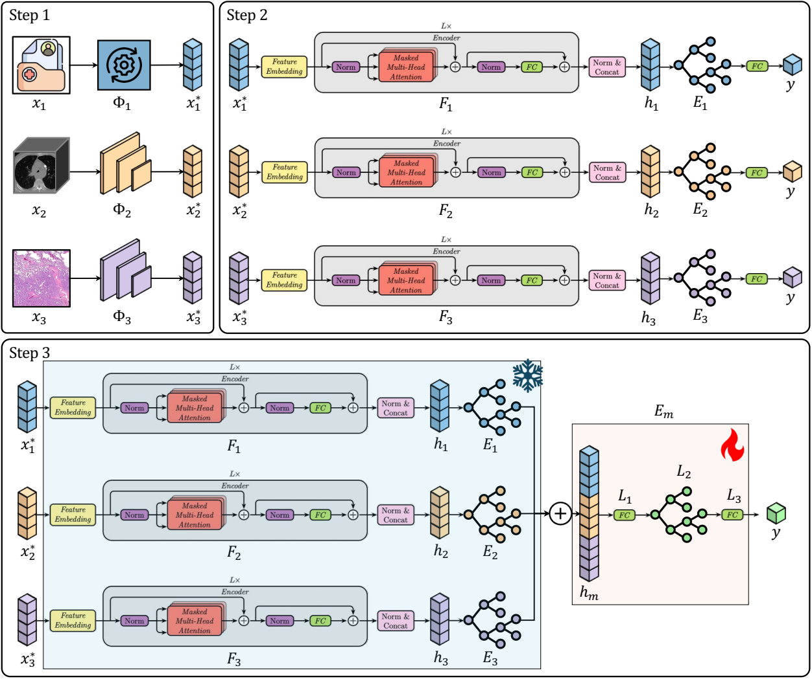
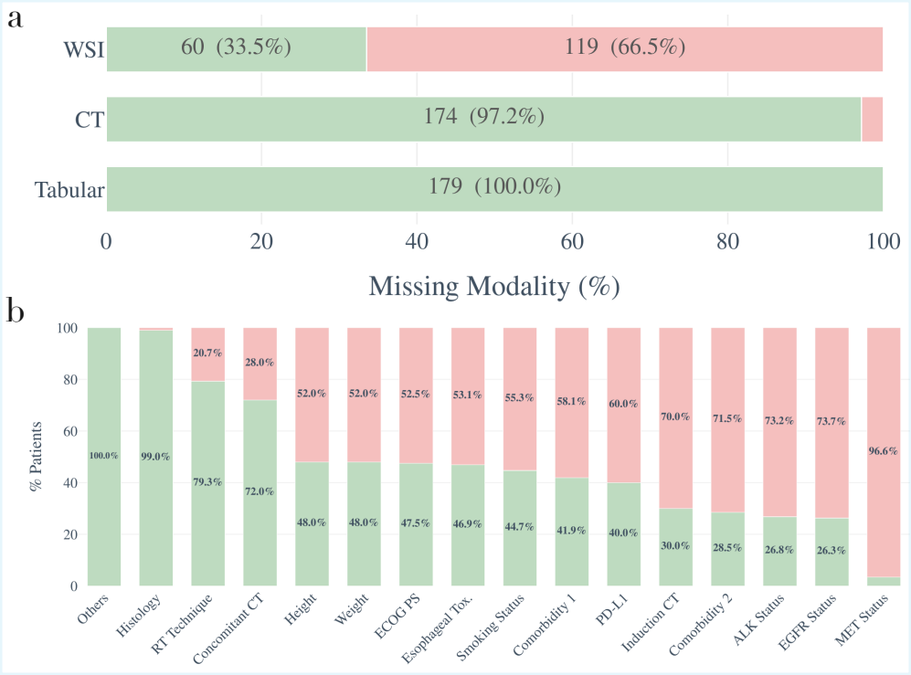
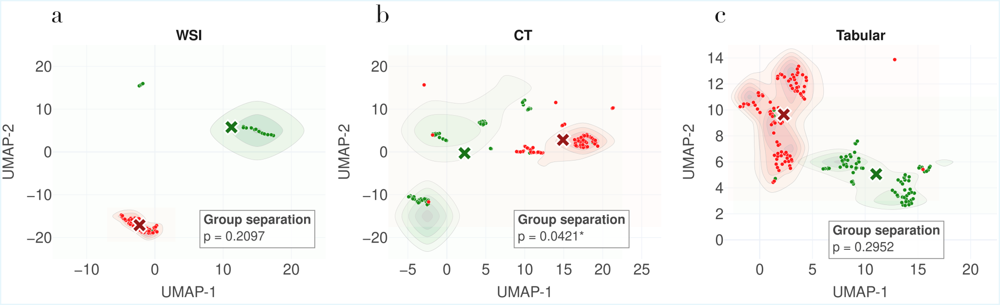
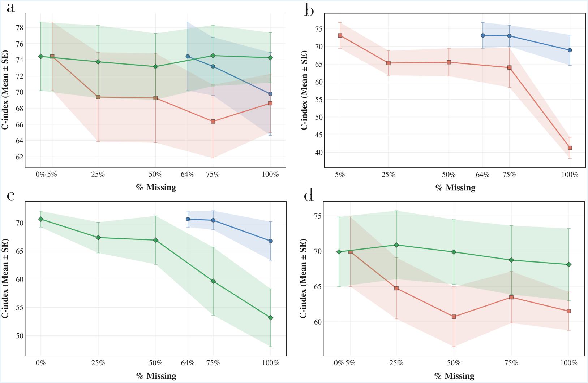
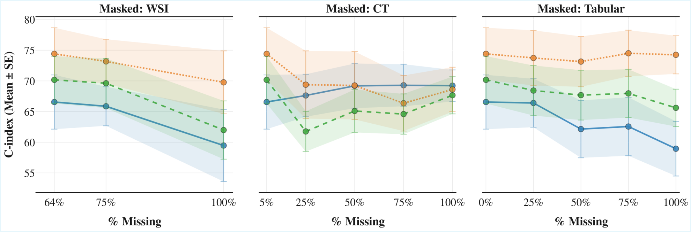
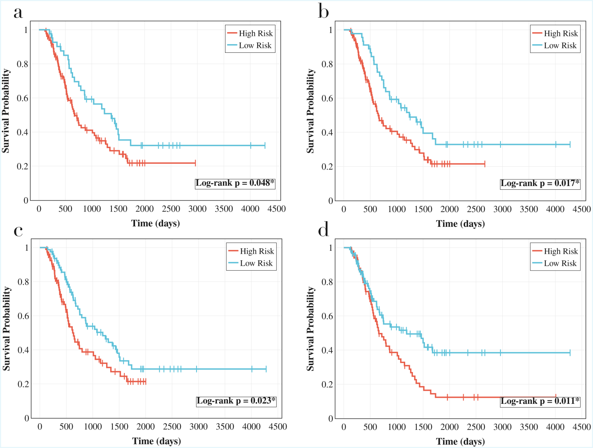
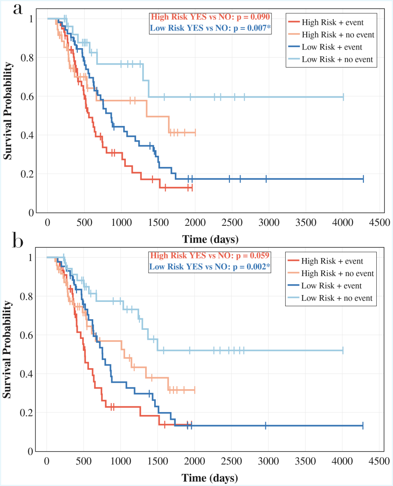

<div align="center">

# Handling Missing Modalities in Multimodal Survival Prediction for Non-Small Cell Lung Cancer

<p align="center">
  <a href="figures/figure2.pdf"></a>
</p>

[
[](https://www.researchsquare.com/article/rs-8490631/latest)
[](https://www.researchsquare.com/article/rs-8490631/latest)
[](https://www.python.org/)
[](https://hydra.cc/)
[](https://creativecommons.org/licenses/by-nc/4.0/)

**A missing-aware multimodal framework that fuses CT, Whole-Slide Histopathology, and clinical tabular data for survival prediction in unresectable stage II–III Non-Small Cell Lung Cancer (NSCLC) — without dropping patients or imputing absent modalities.**

**Filippo Ruffini** · Camillo Maria Caruso · Claudia Tacconi · Lorenzo Nibid · Francesca Miccolis · Marta Lovino · Carlo Greco · Edy Ippolito · Michele Fiore · Alessio Cortellini · Bruno Beomonte Zobel · Giuseppe Perrone · Bruno Vincenzi · Claudio Marrocco · Alessandro Bria · Elisa Ficarra · Sara Ramella · Valerio Guarrasi · **Paolo Soda**

[📄 Paper](https://www.researchsquare.com/article/rs-8490631/latest) ·
[🧩 Architecture](#architecture) ·
[⚙️ Setup](#setup) ·
[🚀 Usage guide](#using-the-repository) ·
[📊 Results](#results) ·
[📚 Citation](#citation)

</div>

---

## Overview

This repository accompanies the paper *"Handling Missing Modalities in Multimodal Survival Prediction for Non-Small Cell Lung Cancer"* ([Research Square — rs-8490631](https://www.researchsquare.com/article/rs-8490631/latest), in press at *npj Digital Medicine*).

We tackle a recurring obstacle in real-world oncology cohorts: patients rarely have every diagnostic modality acquired. Conventional multimodal pipelines either drop incomplete cases or hide the gap behind imputation. We instead train and evaluate a **missing-aware multimodal survival learner** that:

- ingests **Computed Tomography (CT)** volumes via foundation-model embeddings (CT-FM, CT-CLIP, Merlin VLM),
- ingests **Whole-Slide Histopathology Images (WSI)** via pre-extracted patch embeddings,
- ingests **clinical tabular features** (demographics, staging, lab values, treatment),
- and learns an **intermediate fusion** that operates on whatever subset of modalities is available at training and inference time.

The best configuration (intermediate fusion, frozen modality encoders) reaches a **C-index of 74.42** on the held-out splits, outperforming all unimodal baselines and alternative fusion strategies, while producing **statistically significant risk stratification** for disease progression and metastatic risk.

> **Dataset note.** The clinical cohort used to develop and evaluate the model is **not publicly redistributable** under its data-use agreement. The repository contains the **full training, evaluation, and analysis code**, the **experiment configurations**, and **placeholder paths/manifests** that downstream users can adapt to their own NSCLC cohort. See [Data layout](#data-layout) for the expected file structure.

### The missingness problem

<p align="center">
  <a href="figures/figure1.pdf"></a>
</p>

> **Figure 1 — Per-modality and per-feature missingness.**
> *(a)* Modality availability across the study cohort: tabular features are present for every patient (100 %), CT for 97.2 %, and WSI for only 33.5 % — a strongly imbalanced multimodal setting that is typical of real-world oncology data and that motivates the missing-aware design.
> *(b)* Within the tabular modality, missingness is heterogeneous across clinical fields: from fully observed *Histology* (99.0 %) and *RT Technique* (79.3 %) to severely incomplete *MET Status* (3.4 %). Imputation and complete-case filtering would either bias these distributions or discard most of the cohort.

---

## Architecture

<p align="center">
  <a href="figures/figure2.pdf"></a>
</p>

> **Figure 2 — Three-step architecture.**
> *Step 1:* each raw modality $x_i$ (clinical tabular, CT volume, WSI) is mapped to a fixed-length embedding $x_i^*$ through a modality-specific extractor $\Phi_i$ (TabNet / CT-FM / WSI-foundation model).
> *Step 2:* each $x_i^*$ is independently encoded by a masked-multi-head-attention transformer $F_i$ producing $h_i$, then a per-modality survival head $E_i$ outputs $y$. These are the **unimodal baselines**.
> *Step 3:* the per-modality encoders $F_i$ and survival heads $E_i$ are **frozen**, their outputs are concatenated into $h_m$, and a small trainable MLP $E_m = L_1\!\to\!L_2\!\to\!L_3$ is fit on top — the **intermediate-fusion** strategy that yields the best C-index.

The core model is [`MultimodalSurvivalLearner`](CMC_utils/models/generic/multimodal_model.py) — a modality-conditioned encoder–fusion–head architecture:

| Stage | Component | Notes |
|---|---|---|
| **Modality encoders** | TabNet / TabTransformer / FT-Transformer / NAIM (tabular); CT-FM / CT-CLIP / Merlin embeddings (CT); WSI patch-embedding aggregator | Frozen or fine-tuned end-to-end |
| **Missing-mask handling** | Per-sample modality mask propagated through fusion | No imputation; no patient dropping |
| **Fusion strategy** | Early / **Intermediate (best)** / Late | Selected via `cfg.experiment.pipeline` |
| **Survival head** | Cox proportional hazards (DeepSurv-style) | C-index, IBS, time-dependent AUC |

Five pipeline types are dispatched from [`main.py`](main.py): `simple`, `missing`, `multimodal_early_fusion`, `multimodal_joint_fusion`, `multimodal_late_fusion`.

---

## Repository layout

```
.
├── main.py                          # Hydra entry point; dispatches to pipeline
├── confs/                           # Hydra configs (experiments, models, paths, metrics)
│   └── experiment/                  # 30+ predefined experiment YAMLs
├── CMC_utils/                       # Core library
│   ├── datasets/                    # Tabular / Survival / Multimodal datasets
│   ├── models/                      # Tabular, imaging, multimodal models
│   ├── pipelines/                   # simple / missing / multimodal-{early,joint,late}
│   ├── preprocessing/               # Per-fold leakage-safe preprocessing
│   ├── losses/   metrics/   cross_validation/   save_load/
├── bashnew/launch_bash/             # Batch launchers (ML / DL / MM-DL × freeze/unfreeze)
├── features_extraction/             # CT / WSI embedding extraction scripts
├── clinical_features/               # Clinical-tabular feature engineering
├── paper/                           # Figures used in the manuscript (figure1..6.pdf + figure_S1.pdf)
├── plots/                           # Cohort-specific plotting scripts (gitignored)
├── tests/                           # Aggregated fold results & ablation tables
├── CT-CLIP/   CT-FM/   Merlin/      # Foundation-model submodules (see below)
└── data/                            # ⟵ user-provided, NOT included
```

---

## Setup

### 1. Clone with submodules

The CT/VLM foundation models live in three external repositories and are wired in as **git submodules**:

| Submodule | Upstream | Purpose |
|---|---|---|
| [`CT-CLIP`](CT-CLIP) | [ibrahimethemhamamci/CT-CLIP](https://github.com/ibrahimethemhamamci/CT-CLIP) | CT vision–language model |
| [`CT-FM`](CT-FM) | [project-lighter/CT-FM](https://github.com/project-lighter/CT-FM) | CT Foundation Model embeddings |
| [`Merlin`](Merlin) | [StanfordMIMI/Merlin](https://github.com/StanfordMIMI/Merlin) | 3D CT vision–language model |

```bash
# Fresh clone
git clone --recurse-submodules <this-repo-url> AIDA_multimodal_FC
cd AIDA_multimodal_FC

# Already cloned without submodules?
git submodule update --init --recursive
```

### 2. Python environments

Two virtual environments are used. **Python 3.10.4** is the primary version for training and evaluation. **Python 3.12.3** is required for Merlin VLM inference.

```bash
# Primary environment (training, evaluation, analysis)
# Python version used Python 3.10.4-GCCcore-11.3.0 
python -m venv AIDA_MM
source AIDA_MM/bin/activate
pip install --upgrade pip
pip install -r requirements.txt

# Merlin VLM environment (CT embedding extraction with Merlin only)
module load Python/3.12.3-GCCcore-13.3.0    # or: pyenv install 3.12.3
python -m venv merlin_env
source merlin_env/bin/activate
pip install -e Merlin/
```

The pinned `requirements.txt` was regenerated with:

```bash
pip list --format=freeze > requirements.txt
```

Hydra full tracebacks are enabled by default — `main.py` sets `HYDRA_FULL_ERROR=1`.

### 3. Foundation-model weights

The CT foundation models are **not bundled** with this repository — download the official pretrained weights and place them at the paths below. All three are gated on Hugging Face and require `huggingface-cli login` (or `HF_TOKEN` exported in your shell) with a token that has accepted the respective model licences.

| Model | Source | Destination path |
|---|---|---|
| **CT-FM** (SegResEncoder) | `project-lighter/ct_fm_feature_extractor` on Hugging Face | `CT-FM/checkpoints/ct_fm_feature_extractor.pt` |
| **CT-CLIP** (zero-shot) | `hamamci-suite/ct-clip-extended` on Hugging Face | `CT-CLIP/CT_CLIP/clip_weights/CT_CLIP_zeroshot.pt` |
| **Merlin VLM** | `stanfordmimi/Merlin` on Hugging Face | `Merlin/merlin/models/checkpoints/i3_resnet_clinical_longformer_best_clip_04-02-2024_23-21-36_epoch99.pt` |

```bash
# Authenticate once (token at https://huggingface.co/settings/tokens)
huggingface-cli login

# CT-FM
mkdir -p CT-FM/checkpoints
huggingface-cli download project-lighter/ct_fm_feature_extractor \
    --local-dir CT-FM/checkpoints

# CT-CLIP
mkdir -p CT-CLIP/CT_CLIP/clip_weights
huggingface-cli download hamamci-suite/ct-clip-extended CT_CLIP_zeroshot.pt \
    --local-dir CT-CLIP/CT_CLIP/clip_weights

# Merlin (Python 3.12 env)
source merlin_env/bin/activate
python -c "from merlin import Merlin; Merlin()"   # auto-downloads on first call
deactivate
```

> The exact filenames on Hugging Face occasionally change as the upstream repos release new checkpoints — if a download fails, browse the upstream HF page and update the destination path above accordingly.

> ⚠️ **Security note.** The original extraction scripts under `features_extraction/` previously contained an inlined `HF_TOKEN`. Use `huggingface-cli login` or `export HF_TOKEN=…` from your shell instead — never commit the token.

---

## Data layout

The dataset is held under a data-use agreement and **cannot be redistributed**. To run the pipeline on your own NSCLC cohort, mirror the following structure under `data/`:

```
data/
└── tabular/
    └── survival/
        └── <COHORT_NAME>/                       # placeholder for your cohort
            ├── clinical_features.xlsx            # rows = patients, columns = clinical vars
            ├── cv_splits.xlsx                    # stratified train/test fold assignments
            ├── imaging/
            │   └── embeddings_2/                 # CT foundation-model embeddings (.pt / .npy)
            │       ├── CT-FM/
            │       ├── CT-CLIP/
            │       └── Merlin/
            └── wsi/
                └── embeddings/                   # WSI patch embeddings (.pt / .npy)
```

Raw CT volumes (NIfTI) and WSI slides must be **preprocessed into embeddings** with the foundation-model extraction pipeline before training. See [`features_extraction/README.md`](features_extraction/README.md) for the full step-by-step protocol (lung segmentation → bounding-box crop → CT-FM / CT-CLIP / Merlin embedding extraction → WSI patch embedding aggregation).

Then point your config at it by either:

- editing one of the path profiles in [`confs/experiment/paths/`](confs/experiment/paths) (`local`, `alvis_snic`, `SSD`), or
- creating a new profile and selecting it at runtime: `python main.py experiment/paths/system=<my_profile>`.

In the original study these paths resolve to the **AIDA NSCLC cohort** processed at our institution; all experiment YAMLs are named `AIDA_*` and remain unchanged so the published results can be reproduced on the same cohort by anyone with access.

---

## Using the repository

This repository releases the **methodology and the training/evaluation pipeline** described in the paper. The AIDA clinical cohort itself is *not* redistributed (see [Data availability](#data-availability)), so the steps below are written as a **usage guide for applying the framework to your own NSCLC data**. Every `AIDA_*` config is kept verbatim so the published numbers can be re-derived by anyone with access to the original cohort.

### 1. Prepare your cohort

1. **Tabular features.** Place a patient-level clinical table (one row per patient, indexed by patient ID) at `data/tabular/survival/<COHORT>/clinical_features.xlsx`. Required columns: a time-to-event column (days), an event indicator, and the clinical variables you want to feed the tabular encoder.
2. **Cross-validation splits.** Provide an Excel file with the train / test fold assignments at `data/tabular/survival/<COHORT>/cv_splits.xlsx` (one column per fold, values in `{train, test}` or fold indices). The leakage-safe per-fold preprocessing (`set_fold_preprocessing` / `apply_preprocessing`) is driven entirely by this file.
3. **Imaging.** Run the [feature-extraction pipeline](features_extraction/README.md) on your CT NIfTI volumes (lung segmentation → bounding-box crop → CT-FM / CT-CLIP / Merlin embeddings) and on your WSI slides (patch-level aggregation). Outputs land under `data/tabular/survival/<COHORT>/imaging/embeddings_*/` and `…/wsi/embeddings/`.
4. **Wire the paths.** Either edit one of the profiles in [`confs/experiment/paths/`](confs/experiment/paths) (`local`, `alvis_snic`, `SSD`) to point at `<COHORT>`, or add a new profile and select it at runtime with `experiment/paths/system=<my_profile>`.

### 2. Pick an experiment configuration

The repo ships 30+ ready-made YAMLs under [`confs/experiment/`](confs/experiment). They follow the naming convention `<DATA>_<MODALITY>_<TASK>_<MODEL>.yaml`. The three knobs worth knowing:

| Knob | Where it lives | Effect |
|---|---|---|
| **Modality set** | filename suffix (`_CT`, `_WSI`, `_tabular`, `_WSI+CT+tabular`, …) | which encoders are instantiated |
| **Fusion strategy** | `cfg.experiment.pipeline` (`simple`, `missing`, `multimodal_{early,joint,late}_fusion`) | how modalities are combined |
| **Encoder freezing** | `freeze_ms` in the multimodal configs | `freeze` (pre-extracted embeddings used as-is) vs. *unfrozen* (end-to-end fine-tuning) |

To target a different cohort with an existing config, leave the YAML alone and only change the path profile — the experiment name in the output directory still reads `AIDA_*`, but the data behind it is yours.

### 3. Run

**Single experiment (Hydra):**

```bash
source AIDA_MM/bin/activate
python main.py                                        # default: survival_experiment

# Pick any predefined experiment and override individual fields on the CLI
python main.py experiment=AIDA_tabular_Cix-regression_tabnet
python main.py experiment=AIDA_multimodal_WSI+CT+tabular_Cixregression_freeze_ms_cox_label
python main.py device=cpu experiment/paths/system=<my_profile>
```

Outputs (predictions, metrics, checkpoints) land under `outputs/<experiment>/<fold>/`.

**Batch sweeps.** Each launcher fans out experiments in parallel with a configurable `MAX_JOBS=4`:

```bash
bash launch_ML.sh        # classical survival models (Cox PH, RSF, SGB) per modality
bash launch_DL.sh        # PyTorch / Lightning deep models per modality
bash launch_MM_DL.sh     # multimodal (frozen + end-to-end fine-tuning variants)
```

The per-modality and per-strategy launchers under [`bashnew/launch_bash/`](bashnew/launch_bash) are organised as:

```
ML/label-cox/                          # classical, per modality
DL/label-cox/                          # deep, per modality
MM-DL/cox-label-freeze/                # multimodal, frozen encoders
MM-DL/cox-label-unfreeze/              # multimodal, end-to-end fine-tuning
```

### 4. Inspect the results

Once a run finishes, the C-index, integrated Brier score, time-dependent AUC and per-patient risk scores are available under `outputs/<experiment>/`. Aggregate them across folds with the generic scripts described below.

### 5. Extending the framework

- **Add a new modality** — implement an encoder under [`CMC_utils/models/<modality>/`](CMC_utils/models), register it in the corresponding `__init__.py`, and reference it from a new YAML in `confs/experiment/model/`.
- **Add a new fusion** — extend [`CMC_utils/pipelines/`](CMC_utils/pipelines) and add a new value to `cfg.experiment.pipeline`.
- **Add a new metric / loss** — drop a function under [`CMC_utils/metrics/`](CMC_utils/metrics) or [`CMC_utils/losses/`](CMC_utils/losses) and reference it from a `confs/experiment/metric/*.yaml` or `confs/experiment/loss/*.yaml`.

### Analysis & figures

Two layers of analysis scripts ship with the repo:

**Generic aggregators (kept at repo root)** — run on any cohort once `outputs/` has been populated:

| Script | Output |
|---|---|
| `aggregate_results_into_tables.py` | LaTeX-ready aggregate tables under `tests/aggregated/` |
| `aggregate_5fold_ctfm.py` / `aggregate_5fold_merlin.py` | 5-fold aggregated CT-FM / Merlin tables |
| `table_ctfm_architectures.py` | CT-FM architecture sweep table (`tests/table_ctfm_architectures.tex`) |
| `dataset_preparation.py` | Attach imaging-embedding paths to the clinical manifest |

**Cohort-specific plotting scripts (`plots/`, gitignored)** — these contain hard-coded paths, column names and aesthetic choices for the AIDA NSCLC cohort and are *not* tracked by git. They were used to regenerate the manuscript figures and are kept locally as a reference; adapt them to your own cohort if needed.

```
plots/
├── plot_2d_embeddings.py                       → Figure 3 (UMAP per modality)
├── plot_ablation_wsi_ct_tab.py                 → modality-ablation bars
├── plot_ctfm_km_curves.py                      → Figure 5  (KM, CT-FM)
├── plot_merlin_km_curves.py                    → Figure 5b (KM, Merlin)
├── plot_ctfm_missing_modality.py               → Figure 4  (C-index vs. missing)
├── plot_ctfm_vs_merlin_missing_modality.py     → Figure S1 (CT-FM vs Merlin under missingness)
├── plot_ctfm_pfs_metas_stratification.py       → Figure 6  (event-stratified KM)
├── plot_over_missing.py                        → C-index vs. % missing
├── compute_kaplan_meyer_curve_and_stats.py     → KM + log-rank stats
├── generate_plot_survival_curves.py            → survival overlays
├── missing_plot.py                             → per-feature missingness bars (Figure 1b)
├── stratify_by_features.py                     → clinical-feature stratification
└── clinical_features_analysis.py               → tabular cohort statistics
```

---

## Results

Headline numbers reproduced from the paper:

| Modality / Fusion | C-index |
|---|---|
| Tabular (clinical only) | 0.692 |
| CT only (CT-FM embeddings) | 0.681 |
| WSI only | 0.654 |
| CT + Tabular (intermediate, frozen) | 0.721 |
| WSI + Tabular (intermediate, frozen) | 0.708 |
| WSI + CT (intermediate, frozen) | 0.716 |
| **WSI + CT + Tabular (intermediate, frozen)** | **0.7442** |

### Modality embeddings stratify outcomes

<p align="center">
  <a href="figures/figure3.pdf"></a>
</p>

> **Figure 3 — UMAP of high- vs. low-risk patients per modality.** Two-dimensional UMAP projections of the per-modality embeddings produced in *Step 2*. CT embeddings yield a statistically significant separation between the two risk groups (p = 0.0421), while WSI and tabular embeddings carry complementary but individually weaker signal — motivating the fusion in *Step 3*.

### Robustness to missing modalities

<p align="center">
  <a href="figures/figure4.pdf"></a>
  <br/>
  <a href="figures/figure_S1.pdf"></a>
</p>

> **Figure 4 / Figure S1.** C-index degradation as a function of the **percentage of patients with the indicated modality artificially masked** at inference time. Across all three modalities the intermediate-fusion model degrades gracefully, never falling below the corresponding unimodal baseline — confirming that the masking-aware fusion exploits available modalities without becoming brittle when any one of them is missing.

### Kaplan–Meier risk stratification

<p align="center">
  <a href="figures/figure5.pdf"></a>
</p>

> **Figure 5 — KM curves for high vs. low predicted risk.** Each panel (a–d) reports a different model / fusion configuration. The trimodal intermediate-fusion model (panel d) yields the strongest separation between high- and low-risk groups (log-rank p = 0.011).

<p align="center">
  <a href="figures/figure6.pdf"></a>
</p>

> **Figure 6 — KM curves stratified by *predicted risk* × *observed event*.** Splitting the cohort by both the model's risk score and the observed metastasis / progression event shows that the *low-risk + no-event* group is reliably and significantly separated from the rest (log-rank p = 0.007 and p = 0.002), supporting the clinical actionability of the score.

Per-experiment predictions and per-fold metrics are written under `outputs/`; aggregated tables and ablations under `tests/`; figures used in the paper under `paper/`.

> **Note on figure files.** The PDF figures referenced above (`figures/figure1.pdf`, `figure2.pdf`, …, `figure6.pdf`, `figure_S1.pdf`) are the camera-ready vector versions from the paper. For inline rendering on GitHub the PNG counterparts (`figures/figureN.png`) must sit next to them — generate them once with
> ```bash
> for f in figures/figure*.pdf; do pdftoppm -png -r 200 "$f" "${f%.pdf}"; done
> ```
> (requires `poppler-utils`) or with any PDF→PNG converter of your choice.

---

## Data availability

The AIDA NSCLC cohort used to develop and evaluate the methodology in the accompanying paper is **currently under evaluation for publication** and is therefore **not distributed with this repository**. Access is governed by the originating institutions' data-use agreement and by the relevant ethical approvals; researchers interested in the dataset should contact the corresponding authors of the publication.

This release contains only what is needed to **reproduce the methodology**:

- the full training / evaluation / analysis source code,
- the [Hydra](https://hydra.cc/) experiment configurations,
- the feature-extraction pipeline ([`features_extraction/`](features_extraction)),
- the foundation-model wiring as git submodules ([`CT-CLIP/`](CT-CLIP), [`CT-FM/`](CT-FM), [`Merlin/`](Merlin)),
- and placeholder paths / manifests that downstream users can adapt to their own NSCLC cohort.

No patient-level data, intermediate embeddings, or trained model weights derived from the AIDA cohort are included in this repository or in any of its release artifacts.

---

## Citation

If you use this code or build on the methodology, please cite:

```bibtex
@article{ruffini2026missing,
  title  = {Handling Missing Modalities in Multimodal Survival Prediction
            for Non-Small Cell Lung Cancer},
  author = {Ruffini, Filippo and Caruso, Camillo Maria and Tacconi, Claudia and others},
  journal = {Research Square (in press at npj Digital Medicine)},
  note    = {rs-8490631},
  year    = {2026},
  url     = {https://www.researchsquare.com/article/rs-8490631/latest}
}
```

Please also cite the upstream foundation models you use:

- **CT-CLIP** — Hamamci *et al.*, [github.com/ibrahimethemhamamci/CT-CLIP](https://github.com/ibrahimethemhamamci/CT-CLIP)
- **CT-FM** — project-lighter, [github.com/project-lighter/CT-FM](https://github.com/project-lighter/CT-FM)
- **Merlin** — Blankemeier *et al.*, [github.com/StanfordMIMI/Merlin](https://github.com/StanfordMIMI/Merlin)

---

## License

All source code, configurations, documentation, and figures in this repository are released under the **Creative Commons Attribution-NonCommercial 4.0 International License (CC BY-NC 4.0)** — see [`LICENSE`](LICENSE) for the full text and [creativecommons.org/licenses/by-nc/4.0](https://creativecommons.org/licenses/by-nc/4.0/) for the human-readable summary.

In short:

- ✅ **Allowed** — academic research, teaching, non-profit clinical research, personal study, modification and redistribution **with attribution** to the authors and a link to the original paper ([rs-8490631](https://www.researchsquare.com/article/rs-8490631/latest)).
- ❌ **Not allowed without a separate licence** — incorporation into a commercial product or paid service, use within a for-profit clinical decision-support system, paid consulting whose deliverable is derived from this code, or any other commercial exploitation.

For **commercial licensing** please contact the corresponding authors.
